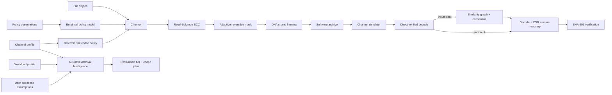

# OligoArk 🧬

[](https://github.com/sauravsingla/OligoArk/actions/workflows/ci.yml) [](https://pypi.org/project/oligoark/)

**AI-Native DNA Archival Storage** — an open-source research framework for adaptive DNA encoding, software channel simulation, graph-assisted reconstruction, empirical policy learning, and explainable heterogeneous storage tiering.

**What the name means:** “Oligo” refers to oligonucleotides—short DNA strands—and “Ark” represents safeguarding information for the future. Together, **OligoArk** expresses the idea of preserving digital information in DNA for long-term archival storage.

> **Research status:** alpha. OligoArk produces DNA-like sequence encodings and software simulations. It does **not** claim wet-lab validation, present-day commercial DNA-storage economics, or physical-media performance.

## Why OligoArk

DNA data storage research has demonstrated high-density archival concepts, random access, error correction, and long-horizon preservation. A practical software research stack also needs to decide **when** a future DNA tier might be appropriate, **how** encoding/redundancy should adapt to channel conditions, and **how** noisy/duplicated reads should be reconstructed. OligoArk treats these questions as one reproducible system rather than only mapping bits to `A/C/G/T`.

## Research contributions

OligoArk v0.3 exposes four testable research layers through one **AI-Native Archival Intelligence Layer**:

1. **Explainable heterogeneous storage tiering** — evaluates SSD, object archive, tape, and an explicitly experimental `dna_future` tier from retention, access, mutability, durability, retrieval urgency, redundancy, energy, and user-supplied normalized economic assumptions.
2. **Adaptive DNA codec policy** — changes chunk size, Reed–Solomon strength, XOR erasure grouping, and sequence masking from simulated channel conditions and durability/overhead/retrieval objectives.
3. **Graph-assisted strand reconstruction** — tries verified direct decoding first, then builds an implicit similarity graph using q-gram prefiltering + Levenshtein scoring and generates deterministic consensus reads before retrying checksum-verified recovery.
4. **Empirical policy learning** — a dependency-free instance-based learning baseline ranks codec policies from prior channel/policy observations. It requires no proprietary model and always coexists with deterministic heuristics.

`plan_archive()` combines workload requirements, channel conditions, economics, storage-tier choice, and codec policy into one explainable recommendation. Reconstruction is separately extensible through typed `ReadReconstructor` and `EdgeScorer` interfaces so future PyTorch/PyTorch-Geometric models can plug in without changing the archive format.

The repository also contains an independently implemented **fountain-style seeded XOR/peeling baseline** for redundancy experiments. It is not represented as the published DNA Fountain implementation.

## Architecture



See [`docs/architecture.md`](docs/architecture.md) for module-level details.

## Install

For normal use, install the published package from PyPI:

```bash
pip install oligoark
```

Optional API support:

```bash
pip install "oligoark[api]"
```

For contributors and research development:

```bash
git clone https://github.com/sauravsingla/OligoArk.git
cd OligoArk
python -m venv .venv
source .venv/bin/activate  # Windows PowerShell: .venv\Scripts\Activate.ps1
python -m pip install -U pip
pip install -e ".[dev,api,bench]"
```

The core package has **no mandatory third-party runtime dependency**. FastAPI, plotting, and development tools are optional extras.

## Quick start

```bash
printf 'OligoArk demo data\n' > demo.txt
oligoark archive demo.txt --output demo.oligoark.json
oligoark inspect demo.oligoark.json
oligoark recover demo.oligoark.json --output recovered.txt
cmp demo.txt recovered.txt
```

`archive` reports measured software facts such as strand count, encoded nucleotide count, GC statistics, homopolymer maximum, logical bits/nucleotide, and SHA-256. These are **software encoding measurements**, not physical synthesis claims.

### Simulate errors and reconstruct reads

```bash
oligoark simulate demo.oligoark.json \
  --substitution 0.001 \
  --dropout 0.01 \
  --duplicate 0.20 \
  --seed 7 \
  --output reads.txt

oligoark recover-reads \
  demo.oligoark.json reads.txt \
  --similarity-threshold 0.90 \
  --output recovered-from-reads.txt
```

The recovery report states whether direct decoding succeeded or graph reconstruction was needed. Recovery is accepted only after the original SHA-256 is reproduced.

### Adaptive codec recommendation

```bash
oligoark policy \
  --substitution 0.01 \
  --deletion 0.002 \
  --dropout 0.08 \
  --durability-priority 0.9 \
  --storage-overhead-priority 0.1
```

### Integrated archival plan

```bash
oligoark plan \
  --retention-years 100 \
  --accesses-per-year 0.1 \
  --durability-priority 1.0 \
  --energy-priority 0.8 \
  --substitution 0.01 \
  --dropout 0.05
```

This command returns one explainable storage-tier recommendation plus an adaptive DNA codec policy. The codec objective is derived transparently from workload priorities unless the Python API caller supplies an explicit objective or empirical model.

### Storage-tier recommendation

```bash
oligoark recommend \
  --retention-years 100 \
  --accesses-per-year 0.1 \
  --mutability 0.0 \
  --retrieval-urgency 0.1 \
  --durability-priority 1.0 \
  --energy-priority 0.8 \
  --redundancy-priority 0.8 \
  --cost-priority 0.5
```

The default economics are deliberately **neutral across tiers**; OligoArk does not invent vendor pricing or future DNA costs. Real normalized inputs can be supplied through the Python API, REST API, or `--economics-json`. For example:

```json
{
  "storage_cost_index": {"ssd": 0.8, "object_archive": 0.3, "tape": 0.2, "dna_future": 0.5},
  "retrieval_cost_index": {"ssd": 0.1, "object_archive": 0.4, "tape": 0.7, "dna_future": 0.9}
}
```

Lower normalized values mean lower assumed cost. These values are user inputs, not prices asserted by OligoArk.

## Python SDK

```python
from oligoark import ArchiveConfig, archive_bytes, archive_statistics, recover_bytes

payload = b"long-lived research artifact"
archive = archive_bytes(payload, ArchiveConfig(rs_nsym=12))
print(archive_statistics(archive).to_dict())
recovered = recover_bytes(archive)
assert recovered == payload
```

### Empirical policy-learning baseline

```python
from oligoark import EmpiricalPolicyModel, PolicyObservation

model = EmpiricalPolicyModel().fit(observations)
recommendation = model.recommend(target_channel)
print(recommendation.policy)
```

`observations` must come from explicitly labeled simulated or measured experiments. The model is transparent instance-based learning, not a pretrained black box.

### AI-Native Archival Intelligence Layer

```python
from oligoark import ChannelProfile, WorkloadProfile, plan_archive

workload = WorkloadProfile(
    retention_years=100,
    accesses_per_year=0.1,
    mutability=0.0,
    retrieval_urgency=0.1,
    durability_priority=1.0,
    energy_priority=0.8,
)
channel = ChannelProfile(substitution_rate=0.01, dropout_rate=0.05)

plan = plan_archive(workload, channel)
print(plan.to_dict())
```

### Reconstruction extension interface

Custom reconstruction methods implement `ReadReconstructor`; custom graph edge models implement `EdgeScorer`. The default `GraphConsensusReconstructor` uses normalized Levenshtein similarity. A future PyTorch/PyTorch-Geometric scorer can be injected with `use_qgram_prefilter=False` without changing encoding, archive metadata, or recovery verification.

## REST API

```bash
uvicorn oligoark.api:app --host 127.0.0.1 --port 8000
```

Open `/docs` for the generated OpenAPI UI. Endpoints include:

- `GET /health`
- `POST /encode`
- `POST /recover`
- `POST /recover-reads`
- `POST /simulate`
- `POST /recommend`
- `POST /policy`
- `POST /plan`

Runtime settings can be supplied via `OLIGOARK_LOG_LEVEL`, `OLIGOARK_RECONSTRUCTION_THRESHOLD`, and `OLIGOARK_MAX_API_PAYLOAD_BYTES`. See [`docs/configuration.md`](docs/configuration.md).

## Reproducible benchmark

```bash
python benchmarks/run_benchmark.py
```

The benchmark writes:

- `benchmark-results/results.json`
- `benchmark-results/results.csv`
- `benchmark-results/metadata.json`
- `benchmark-results/recovery_by_regime.png` when Matplotlib is installed
- `benchmark-results/overhead_by_regime.png` when Matplotlib is installed

Metadata records the OligoArk version, Python version, platform, deterministic seed, payload size, payload SHA-256, and claim scope.

### Current deterministic software-simulation finding

With seed `2026` and an 8 KiB deterministic payload, the deterministic benchmark shows:

| Simulated regime | Fixed | Adaptive |
| --- | --- | --- |
| Clean | recovered | recovered |
| 0.1% substitutions | recovered | recovered |
| 1% substitutions | **failed** | **recovered** |
| 0.1% insertions | failed | failed |
| 0.1% deletions | failed | failed |
| 2% dropout | failed | failed |
| Mixed channel | failed | failed |

For the 1% substitution case, the adaptive policy increased encoded size from **47,468 nt** to **57,024 nt** while changing the deterministic result from failure to successful SHA-256-verified recovery. This is a **software simulation result**, not evidence about any physical synthesis or sequencing platform. Indel/dropout failures are intentionally retained as documented research gaps rather than hidden by claims.

See [`docs/benchmarking.md`](docs/benchmarking.md) for interpretation rules.

## Tests and quality gates

```bash
pytest --cov=oligoark --cov-report=term-missing
ruff check .
mypy src/oligoark
python -m build
python -m compileall -q src tests examples benchmarks
python examples/end_to_end.py
python examples/noisy_recovery.py
python examples/policy_learning.py
python examples/archival_plan.py
python examples/custom_reconstructor.py
python benchmarks/run_benchmark.py
```

The test suite includes unit, integration, API, CLI, reconstruction plug-in, archival-intelligence, ECC, policy-learning, archive-validation, version-synchronization, and Hypothesis property-based tests. CI runs supported Python versions independently, enforces at least 80% coverage, builds the package and Docker image, runs all examples, executes the deterministic benchmark, verifies CSV/JSON/metadata outputs, generates both benchmark plots, and uploads benchmark artifacts. Tag pushes matching `v*` build installable release artifacts in a separate release workflow.

## Scientific assumptions and limitations

- The base codec is a reversible 2-bit mapping wrapped in protected frames; it is not claimed to be capacity-optimal.
- GC/homopolymer scoring is a transparent mask-selection heuristic, not a biochemical synthesis model.
- Reed–Solomon protects frame bytes; XOR parity currently supports one erasure per parity group.
- The simulator uses independent substitution/insertion/deletion/dropout/duplication probabilities. Real channels can be correlated and platform-specific.
- The default graph baseline uses q-gram prefiltering, Levenshtein similarity, medoids, and same-length majority consensus. The extension interfaces are production-tested, but no GNN model is bundled or claimed to outperform published decoders; the baseline remains weak on indels.
- The `dna_future` storage tier is scenario analysis only. It is not a statement that DNA is presently cheaper, faster, or operationally superior to SSD/object/tape.
- Economic defaults are neutral. Production decisions require externally sourced and time-appropriate cost, energy, durability, and retrieval assumptions.
- The reference API is a research service, not a hardened multi-tenant production system.

## Research roadmap

1. Implement and evaluate PyTorch/PyTorch-Geometric `EdgeScorer`/`ReadReconstructor` plug-ins for insertion/deletion-heavy channels.
2. Candidate-policy search trained on reproducible simulation grids and eventually published physical datasets.
3. Pluggable synthesis/sequencing channel models calibrated to specific published datasets.
4. Additional constrained codecs and rateless/fountain baselines under one benchmark protocol.
5. Sensitivity analysis for user-supplied cost/energy assumptions across 10/50/100/500-year horizons.
6. Rust acceleration for codec, edit distance, q-gram indexing, and large-read clustering hot paths.
7. Optional real synthesis/sequencing adapters isolated behind interfaces so simulation results cannot be confused with wet-lab evidence.

## Prior work and attribution

OligoArk is independently implemented and does not vendor or copy another DNA-storage repository. Relevant foundations include:

- Church, Gao & Kosuri (2012), *Next-generation digital information storage in DNA*, **Science**. DOI: `10.1126/science.1226355`.
- Goldman et al. (2013), *Towards practical, high-capacity, low-maintenance information storage in synthesized DNA*, **Nature**. DOI: `10.1038/nature11875`.
- Grass et al. (2015), *Robust Chemical Preservation of Digital Information on DNA in Silica with Error-Correcting Codes*, **Angewandte Chemie International Edition**. DOI: `10.1002/anie.201411378`.
- Erlich & Zielinski (2017), *DNA Fountain enables a robust and efficient storage architecture*, **Science**. DOI: `10.1126/science.aaj2038`.
- Yazdi, Gabrys & Milenkovic (2017), *Portable and Error-Free DNA-Based Data Storage*, **Scientific Reports**. DOI: `10.1038/s41598-017-05188-1`.
- Organick et al. (2018), *Random access in large-scale DNA data storage*, **Nature Biotechnology**. DOI: `10.1038/nbt.4079`.

See [`docs/research.md`](docs/research.md) for research framing and claim boundaries.

## Security

OligoArk parses untrusted archive-like input and performs potentially expensive reconstruction. Do not expose the reference API directly to untrusted networks without authentication, rate limiting, request limits, and deployment hardening. See [`SECURITY.md`](SECURITY.md).

## Contributing

Contributions are welcome. Read [`CONTRIBUTING.md`](CONTRIBUTING.md), especially the requirement to label results as **measured software result**, **simulation result**, **external published result**, or **hypothesis**.

## License

MIT — see [`LICENSE`](LICENSE).
