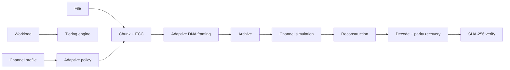

# OligoArk 🧬

**AI-Native DNA Archival Storage** — an open-source research framework for adaptive DNA encoding, software channel simulation, reliable reconstruction, and explainable heterogeneous storage tiering.

> **Status:** research alpha. OligoArk produces DNA-like sequence encodings and software simulations. It does **not** claim wet-lab validation, current commercial DNA-storage economics, or physical-media performance.

## Why OligoArk

DNA storage research has demonstrated compelling archival density and durability concepts, but a practical software research stack also needs decisions around **when** a DNA tier makes sense, **how** codec parameters should adapt to channel conditions, and **how** noisy reads should be reconstructed. OligoArk treats those decisions as one reproducible system rather than only mapping bits to A/C/G/T.

### Research contributions implemented in v0.1

- **Explainable heterogeneous tiering** — scores SSD, object archive, tape, and an explicitly experimental future-DNA tier from retention, access, mutability, durability, latency, and energy priorities.
- **Adaptive codec policy** — chooses chunk size, Reed-Solomon strength, XOR parity grouping, and sequence masking from a simulated channel profile.
- **Graph-assisted reconstruction baseline** — deterministic similarity clustering + medoid/consensus interfaces designed so future GNN edge scorers can be evaluated without coupling ML to the core codec.
- **Integrity-first recovery** — CRC per strand plus archive-level SHA-256 verification.
- **Fountain-style research baseline** — seeded overlapping XOR symbols with peeling decode for experiments; independently implemented and explicitly not the published DNA Fountain implementation.

## Architecture



See [`docs/architecture.md`](docs/architecture.md) for details.

## Install

```bash
python -m venv .venv
source .venv/bin/activate  # Windows: .venv\Scripts\activate
python -m pip install -U pip
pip install -e ".[dev,api,bench]"
```

## Quick start

```bash
printf 'OligoArk demo data\n' > demo.txt
oligoark archive demo.txt --output demo.oligoark.json
oligoark recover demo.oligoark.json --output recovered.txt
cmp demo.txt recovered.txt
```

The archive command reports measured software facts such as DNA-string length and SHA-256. It does not infer physical synthesis cost or sequencing accuracy.

### Simulate a channel

```bash
oligoark simulate demo.oligoark.json \
  --substitution 0.001 \
  --dropout 0.01 \
  --duplicate 0.10 \
  --seed 7 \
  --output reads.txt

oligoark recover-reads demo.oligoark.json reads.txt --output recovered-from-reads.txt
```

Recovery can fail if corruption exceeds the configured code/redundancy budget; this is expected and is part of the research surface.

### Adaptive policy recommendation

```bash
oligoark policy --substitution 0.01 --deletion 0.002 --dropout 0.08
```

### Storage-tier recommendation

```bash
oligoark recommend \
  --retention-years 100 \
  --accesses-per-year 0.1 \
  --mutability 0.0 \
  --retrieval-urgency 0.1 \
  --durability-priority 1.0 \
  --energy-priority 0.8
```

Scores are normalized research heuristics, not vendor price quotes. Replace them with real operational/economic inputs before production use.

## Python SDK

```python
from oligoark import ArchiveConfig, archive_bytes, recover_bytes

payload = b"long-lived research artifact"
archive = archive_bytes(payload, ArchiveConfig(rs_nsym=12))
recovered = recover_bytes(archive)
assert recovered == payload
```

## REST API

```bash
uvicorn oligoark.api:app --reload
```

Then visit `/docs` for the OpenAPI UI. The API exposes `/health`, `/encode`, `/recover`, and `/recommend`.

## Reproducible benchmark

```bash
python benchmarks/run_benchmark.py
```

Outputs are written to `benchmark-results/results.json` and `benchmark-results/results.csv`; when Matplotlib is installed, `recovery_by_regime.png` is generated as well. The benchmark deliberately labels its outputs as **software simulation results**.

A deterministic local run using seed `2026` showed the intended adaptive-policy trade-off: under the included 1% substitution simulation, the fixed baseline failed while the adaptive policy recovered successfully, at the cost of higher nucleotide/strand overhead. Re-run the benchmark on the exact commit and environment before citing results.

## Tests and quality gates

```bash
pytest
ruff check .
mypy src/oligoark
python -m build
python examples/end_to_end.py
```

GitHub Actions runs these checks across supported Python versions.

## Scientific assumptions and limitations

- The base codec is a reversible 2-bit mapping wrapped in framed payloads; it is not claimed to be capacity-optimal.
- GC/homopolymer scoring is a simple software heuristic used to compare reversible masks, not a biochemical synthesis model.
- Reed-Solomon protects framed payload bytes; XOR parity provides single-erasure recovery per parity group.
- The simulator models independent substitutions, insertions, deletions, dropout, and duplication. Real synthesis/sequencing channels can exhibit correlated and platform-specific errors that this baseline does not model.
- The graph reconstruction module is presently a deterministic baseline and does not claim state-of-the-art sequence reconstruction.
- `dna_future` in the tiering model is a scenario-analysis tier, not a recommendation to replace existing archival systems today.

## Research roadmap

1. Pluggable synthesis/sequencing channel models calibrated to published datasets.
2. Multiple sequence-constrained codecs and fountain/rateless baselines under one benchmark interface.
3. True graph construction over noisy reads with learned edge scoring and PyTorch Geometric GNN experiments.
4. Calibrated economic/energy models using user-supplied assumptions and sensitivity analysis.
5. Rust extensions for codec, edit-distance, and large-read clustering hot paths.
6. Optional physical-lab adapters isolated from the simulation-only core.

## Prior work and attribution

OligoArk is independently implemented and does not vendor or copy another DNA-storage repository. It builds on ideas established by the DNA-storage literature, including:

- Church, Gao & Kosuri, **Science (2012)**, DOI `10.1126/science.1226355`.
- Erlich & Zielinski, **Science (2017)**, DOI `10.1126/science.aaj2038`.
- Organick et al., **Nature Biotechnology (2018)**, DOI `10.1038/nbt.4079`.

See [`docs/research.md`](docs/research.md) for research framing and caveats.

## Security

OligoArk parses untrusted archive-like input. Do not treat it as a hardened storage service yet. See [`SECURITY.md`](SECURITY.md).

## Contributing

Contributions are welcome. Please read [`CONTRIBUTING.md`](CONTRIBUTING.md), especially the rules separating measured, simulated, and hypothesized results.

## License

MIT — see [`LICENSE`](LICENSE).
