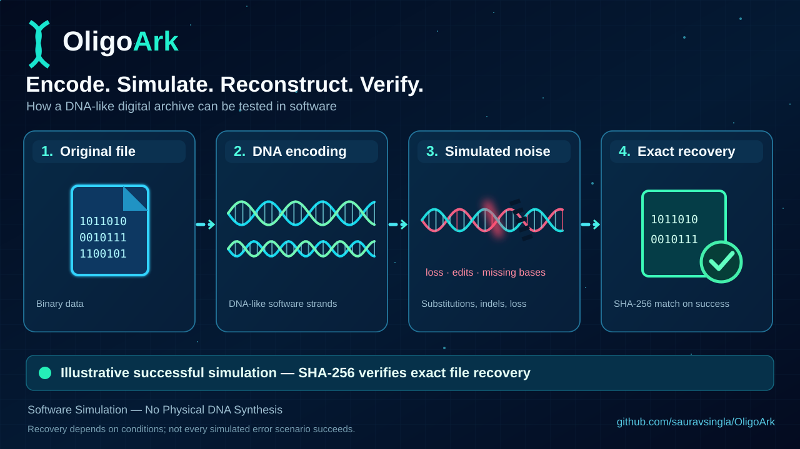

# 🧬 OligoArk

**DNA data-storage research you can run, stress-test, and reproduce.**

Encode digital files as **DNA-like strands**, simulate missing or corrupted reads, reconstruct the data, and verify recovery using **SHA-256** — all in software.

[](pyproject.toml)
[](LICENSE)
[](docs/research.md)

**Encode → Simulate noise → Reconstruct → Verify**

## See the workflow in action



*Illustrative software workflow: Original file → DNA-like strands → Simulated errors → Exact recovery when verification succeeds. Results depend on the simulated conditions; no physical DNA synthesis or sequencing is shown.*

[**Try the demo**](#quick-start) · [**See the results**](#featured-benchmark-10-mib) · [**Explore the methods**](docs/research.md) · [**Contribute**](CONTRIBUTING.md)

> **Research status:** OligoArk is **simulation-first**, not a physically validated DNA-storage product. Published physical sequencing reads have been used for **reference-level reconstruction tests**, but an OligoArk-encoded archive has **not** completed DNA synthesis → sequencing → end-to-end recovery.

## Quick start

**Python 3.10+ and Git required.** No lab equipment or sequencing data needed for this demo.

```bash
git clone https://github.com/sauravsingla/OligoArk.git
cd OligoArk
python -m pip install -e .
python examples/quick_start.py
```

Expected output begins with:

```text
PASS: original data recovered exactly
Bytes: 61
```

The example uses **seed 42**, prints the recovered payload's SHA-256 digest, and explicitly identifies the channel as simulated. See the [demo source](examples/quick_start.py) or [end-to-end example](examples/end_to_end.py).

## What can you explore?

- **Reliable reconstruction from noisy reads:** experiment with multi-start, bidirectional trace consensus and confidence-guided edits. [Implementation](src/oligoark/reconstruct.py) · [Physical-read evaluation](docs/external-cnr-benchmark.md).
- **Adaptive DNA-storage coding:** test coding, redundancy, and reconstruction choices using disjoint calibration and evaluation seeds, with recovery, overhead, and runtime recorded. [Methods and ablations](docs/research.md).
- **Reproducible comparisons:** inspect exact-recovery counts, unsuccessful trials, timeouts, and independently implemented comparison baselines. [Benchmark methodology](docs/benchmarking.md).
- **Separate streaming-scale evaluation:** investigate bounded-memory software archiving without confusing scale tests with constrained-strand codec comparisons. [Scalable storage](docs/scalable-storage.md).

## Featured benchmark: 10 MiB

**The headline:** OligoArk compact-v3 achieved **9/10 exact recoveries** with simulated substitutions and **9/10 with mixed errors**; the two evaluated comparison baselines recorded **0/10** in those conditions. **Indel-only recovery was 0/10** for compact-v3 within the trial deadline.

One deterministic **10 MiB** payload; **152-nt maximum strands**; approximately **25% redundancy**; identical simulated channel conditions and trial seeds; **10 trials per condition**. Each result is the number of complete, SHA-256-verified recoveries.

| Simulated condition | OligoArk compact-v3 | DNA Fountain-style | Goldman-style + XOR |
| --- | ---: | ---: | ---: |
| Clean | **10/10** | **10/10** | **10/10** |
| 1% strand loss | **10/10** | **10/10** | 0/10 |
| 5% strand loss | **10/10** | **10/10** | 0/10 |
| Substitutions | **9/10** | 0/10 | 0/10 |
| Insertions/deletions | **0/10 (timeouts)** | 0/10 | 0/10 |
| Mixed errors | **9/10** | 0/10 | 0/10 |

**Measured compact-v3 profile:** 1.263 logical bits/nt · 48.89 s encoding · 436.33 MiB peak RAM (one GitHub-runner measurement). All 10 compact-v3 indel-only trials exceeded the **75-second per-trial deadline**. The fourth evaluated method, OligoArk compact hybrid, recovered 10/10 clean trials and 0/10 in each noisy condition.

**Read this comparison carefully:** the baselines are independent **style approximations**, not bit-compatible reproductions of the published encoders. These software measurements do **not** establish general speed superiority, statistically significant dominance, or physical DNA-storage recovery. [Baseline design and provenance](docs/dna-fountain-baseline.md).

### All benchmark reports

- **10 MiB matched-codec benchmark (completed):** [Codec baseline and provenance](docs/dna-fountain-baseline.md) · [Benchmark methodology](docs/benchmarking.md).
- **100 MiB matched-codec research (partial):** [Workflow, artifacts, and failure logs](https://github.com/sauravsingla/OligoArk/actions/runs/37766665792) · [Evaluated commit](https://github.com/sauravsingla/OligoArk/commit/d7b0f89a3e7521f02381a872be92b37342607f71). Compact-v3 verified 21/60 recoveries; DNA Fountain had **no verified trial outcomes** before its worker budget expired. **Not a complete four-method comparison.**
- **1 GiB streaming archive (completed):** [Scale acceptance evidence](docs/storage-scale-acceptance-2026-10-07.md) · [Streaming-storage design](docs/scalable-storage.md). Exact SHA-256 recovery under clean, 1%, and 5% controlled strand-loss conditions; **not** the 152-nt matched-codec experiment.
- **Independent published physical reads (reference reconstruction only):** [Microsoft CNR](docs/external-cnr-benchmark.md) · [Grass et al.](docs/external-grass-benchmark.md) · [LCRC HFS-11.7K](docs/external-lcrc-benchmark.md) · [DNAformer Pilot](docs/external-dnaformer-pilot-benchmark.md). These reads were **not encoded with OligoArk**; small recovery differences from the BBS baseline were not statistically significant on the selected subsets, and BBS was substantially faster.
- **v0.6 held-out research ablations (separate smaller-payload study):** [Research results](docs/research.md) · [Reproduction instructions](docs/benchmarking.md). Records **1,680 held-out software trials** across coding and reconstruction strategies.

**Important:** The codec, streaming, held-out ablation, and physical-read experiments use **different protocols and payloads**. Do not combine their success rates. Archive recovery requires exact SHA-256 agreement with the original payload; reference-strand reconstruction is measured separately.

## Limitations and research boundaries

- **Indel-only recovery at 10 MiB is 0/10** under the specified timeout, and substitutions/mixed errors remain challenging in the partial 100 MiB research.
- **The 100 MiB four-method comparison is unfinished** because DNA Fountain did not produce verified results within its worker budget.
- **Wet-lab proof is still pending.** The repository provides synthesis-ready FASTA/CSV and a [wet-lab validation protocol](docs/wet-lab-validation.md), but an OligoArk-encoded archive has **not** undergone synthesis, sequencing, and exact recovery.
- **Novelty is bounded:** OligoArk combines and evaluates established methods. Fountain codes, Reed–Solomon protection, graph reconstruction, and sequence screening are not claimed as inventions. Confidence fusion is a research contribution candidate, not an established state-of-the-art or first-of-its-kind claim.

## Learn more and contribute

[Architecture](docs/architecture.md) · [Research and prior work](docs/research.md) · [Configuration](docs/configuration.md) · [Benchmarking and reproducibility](docs/benchmarking.md)

Found an issue, have a challenging dataset, or want to improve reconstruction? [Open an issue](https://github.com/sauravsingla/OligoArk/issues) or follow the [contribution guide](CONTRIBUTING.md). Please include reproducible commands and clearly distinguish simulations from physical evidence.

**License:** [MIT](LICENSE).
