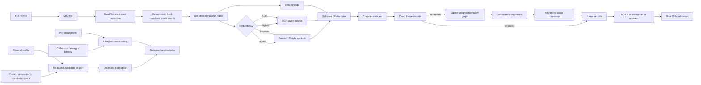

# OligoArk architecture

## Module boundaries

| Module | Responsibility |
| --- | --- |
| `dna.py` | Reversible byte/base mapping, sequence metrics, hard GC/homopolymer constraints |
| `framing.py` | Versioned strand headers, CRC, Reed-Solomon integration and deterministic mask search |
| `ecc.py` | Pure-Python Reed-Solomon plus XOR erasure helpers |
| `fountain.py` | Seeded LT-style XOR symbols and peeling decode |
| `archive.py` | Data/XOR/fountain/hybrid archive creation, validation, recovery and SHA-256 verification |
| `simulator.py` | Seeded substitution/insertion/deletion/dropout/duplication channel |
| `reconstruct.py` | Explicit similarity graphs, connected components, global alignment and consensus |
| `policy.py` | Lightweight deterministic heuristic policy for fast baseline use |
| `optimizer.py` | Real candidate search based on measured simulated recovery/overhead/runtime |
| `learning.py` | Instance-based and ridge-regression policy-learning baselines |
| `tiering.py` | Explainable tier scoring and optional caller-supplied lifecycle estimates |
| `intelligence.py` | Heuristic and measured archival-planning orchestration |
| `experiments.py` | Multi-seed ablations, recovery confidence intervals and aggregation |
| `api.py` / `cli.py` | REST and command-line surfaces |

## Design principles

1. **Integrity is the hard gate.** A recovery success requires exact bytes and archive SHA-256 verification.
2. **Heuristic and optimizer are named separately.** `plan_archive()` is lightweight heuristic planning; `optimize_archive_plan()` actually evaluates candidate configurations.
3. **Hard constraints are real.** New archives enforce configured GC bounds and homopolymer limits during deterministic re-encoding; failure is explicit if no candidate satisfies them.
4. **Redundancy is composable.** XOR, fountain-style, and hybrid strategies share the same framed archive and recovery path.
5. **Graph means graph.** Reads are explicit nodes, similarity relationships are weighted edges, and clusters are graph connected components rather than representative-only buckets.
6. **Indel handling has an alignment baseline.** Consensus aligns reads globally to a medoid before voting over bases and insertion slots.
7. **No fabricated physical economics.** Lifecycle cost, energy and latency estimates exist only when the caller supplies values.
8. **Simulation is labeled as simulation.** Software experiments do not imply synthesis or sequencing performance.
9. **ML remains optional.** Deterministic baselines work without PyTorch; typed interfaces remain available for learned scorers/reconstructors.
10. **Rust-ready hot paths.** Codec, ECC, masking, edit distance and graph construction remain isolated enough for future native acceleration.

## Archive format and compatibility

The JSON archive remains `oligoark-archive-v1`. Existing v0.1-v0.3 configuration dictionaries remain readable because new v0.4 fields have backward-compatible defaults. Each strand contains a one-byte mask identifier plus a Reed-Solomon-protected frame with magic/version, flags, logical index, total data-strand count, payload length and CRC32.

Mask IDs 0-3 retain the earlier constant XOR masks. IDs 4-255 deterministically generate whitening streams, giving the encoder a larger search space for hard sequence constraints while remaining reversible. New flags distinguish XOR parity from fountain symbols. Fountain symbol seeds are stored in the existing 32-bit frame index and deterministically regenerate their source-chunk sets.

## Recovery pipeline

`recover_bytes()` decodes valid frames, combines available data with XOR parity and fountain symbols, iterates erasure recovery, reassembles the original byte stream, and accepts it only if SHA-256 matches archive metadata.

`recover_from_reads()` first tries this direct path. If it fails, the default `GraphConsensusReconstructor` builds an explicit similarity graph, computes connected components, performs alignment-aware consensus per component, appends consensus candidates to the original reads, and retries verified recovery.

## Optimisation pipeline

`optimize_codec()` enumerates a configurable candidate space containing chunk sizes, Reed-Solomon strengths, redundancy schemes, fountain ratios, hard sequence constraints and direct/graph reconstruction modes. Each candidate is actually encoded and passed through the configured software channel for deterministic seeds. The optimizer records SHA-256-verified recovery rate, encoded nucleotide overhead, runtime and graph use, then applies caller-visible objective weights.

`optimize_archive_plan()` combines the measured codec winner with heterogeneous tiering and optional lifecycle estimates. Its output includes the selected redundancy scheme, reconstruction strategy and hard sequence constraints.

## Experiment pipeline

`run_experiments()` supports repeatable multi-seed/payload/scenario sweeps and the five core ablations: fixed, adaptive, adaptive+fountain/hybrid, adaptive+graph, and combined measured optimisation. Aggregation reports recovery rate with Wilson 95% intervals plus overhead, runtime and graph-use metrics.
