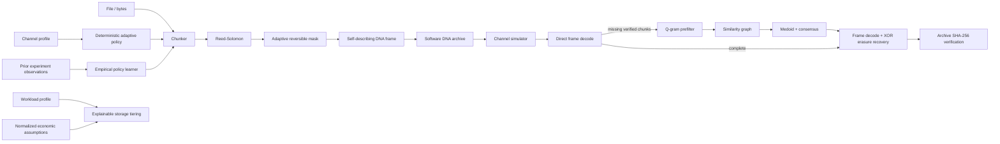

# OligoArk architecture

## Module boundaries

| Module | Responsibility |
| --- | --- |
| `dna.py` | Reversible byte/base mapping and sequence-quality metrics |
| `framing.py` | Versioned strand headers, CRC, masking, Reed–Solomon integration |
| `ecc.py` | Pure-Python Reed–Solomon plus XOR erasure helpers |
| `archive.py` | Archive creation, validation, statistics, recovery, graph-retry pipeline |
| `simulator.py` | Seeded substitution/insertion/deletion/dropout/duplication channel |
| `reconstruct.py` | Q-gram-filtered similarity graph and deterministic consensus baseline |
| `fountain.py` | Independent seeded XOR/peeling research baseline |
| `policy.py` | Deterministic channel/objective-aware codec policy |
| `learning.py` | Dependency-free empirical policy-learning baseline |
| `tiering.py` | Explainable heterogeneous storage scoring and economic assumptions |
| `config.py` | Runtime configuration from JSON/environment |
| `api.py` / `cli.py` | Service and command-line surfaces |

## Design principles

1. **Reproducible baseline first.** Core functionality is deterministic and does not require a trained model.
2. **Integrity is a hard gate.** Recovery is successful only if archive-level SHA-256 matches.
3. **Research modules remain separable.** Codec policy, empirical learning, reconstruction, tiering, and channel models can be replaced independently.
4. **Simulation is labeled as simulation.** No software benchmark is presented as synthesis or sequencing evidence.
5. **No fabricated economics.** Economic defaults are neutral; users must supply real assumptions when making decisions.
6. **Rust-ready hot paths.** `dna.py`, `ecc.py`, `framing.py`, and `reconstruct.py` expose narrow boundaries suitable for future native acceleration.

## Archive format v1

An archive is JSON with `metadata` plus a list of DNA strings. Each strand encodes a binary frame containing magic/version fields, a parity flag, logical index, total data-strand count, raw payload length, and CRC32. The protected payload is Reed–Solomon encoded, then one of four reversible XOR masks can be selected using a GC/homopolymer heuristic. Separate XOR parity strands provide one-erasure recovery within each parity group.

Archive metadata includes the original byte size, SHA-256, codec configuration, data/parity strand counts, and measured encoding statistics. Unknown archive formats and malformed mandatory metadata are rejected.

## Recovery pipeline

`recover_from_reads()` first attempts normal frame decoding because valid Reed–Solomon-correctable reads need no expensive graph work. If verified recovery fails, reads are clustered through a q-gram prefilter and normalized Levenshtein similarity. Consensus reads are appended to the original reads and decoding is retried. The result is accepted only after SHA-256 verification.

This fallback is intentionally conservative. The current consensus model is not a multiple-sequence alignment algorithm, so insertion/deletion-heavy channels remain an explicit research gap.
