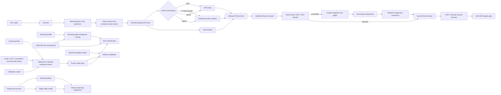

# OligoArk architecture



## Module boundaries

| Module | Responsibility |
| --- | --- |
| `dna.py` | Reversible byte/base mapping, sequence metrics, hard GC/homopolymer constraints |
| `framing.py` | Versioned strand headers, CRC, Reed-Solomon integration, deterministic mask search |
| `ecc.py` | Pure-Python Reed-Solomon plus XOR erasure helpers |
| `fountain.py` | Seeded LT-style XOR symbols and peeling decode |
| `archive.py` | Archive creation/validation/recovery, graph fallback orchestration, SHA-256 verification |
| `simulator.py` | Seeded substitution/insertion/deletion/dropout/duplication software channel |
| `reconstruct.py` | Explicit weighted similarity graphs, components, medoid and alignment consensus |
| `validation.py` | Direct-vs-medoid-vs-alignment graph-rescue ablation and diagnostics |
| `policy.py` | Lightweight deterministic heuristic codec policy |
| `optimizer.py` | Canonical candidate enumeration, balanced/full-grid measured search, objective decomposition |
| `learning.py` | Instance-based and ridge-regression policy models plus interpretable serialization |
| `learning_eval.py` | Experiment-record conversion and held-out learning/generalization evaluation |
| `tiering.py` | Decomposable tier scoring and optional caller-supplied lifecycle estimates |
| `intelligence.py` | Heuristic planning, joint lifecycle-aware optimization, held-out optimizer evaluation |
| `experiments.py` | Disjoint calibration/evaluation sweeps, Wilson intervals, paired strategy effects |
| `api.py` / `cli.py` | REST and command-line research surfaces |

## Design principles

1. **Integrity is the hard gate.** A recovery success requires the ordinary archive decoder to reproduce the original SHA-256.
2. **Calibration and evaluation are distinct.** Search choices are made on calibration seeds and assessed on disjoint unseen seeds.
3. **Heuristic and optimizer are named separately.** `plan_archive()` is lightweight; `optimize_archive_plan()` encodes/simulates/recovers/measures candidates.
4. **Search budgets are not Cartesian-prefix truncation.** Canonical enumeration removes input-order effects and balanced deterministic sampling covers redundancy/reconstruction strata. Full-grid mode is explicit.
5. **Objective contributions are inspectable.** Recovery, overhead, redundancy, runtime, retrieval, durability and optional lifecycle terms are returned per candidate.
6. **Hard constraints are real.** GC/homopolymer bounds are enforced during deterministic reversible mask search.
7. **Redundancy is composable.** XOR, LT-style fountain and hybrid strategies use the same framed archive/recovery path.
8. **Graph means graph.** Reads are nodes, relationships are retained weighted edges, and graph connected components define clusters.
9. **Indel handling has an ablation baseline.** Medoid/non-alignment and medoid-anchored alignment consensus can be compared on the same graph.
10. **No fabricated physical economics.** Cost, energy and latency numbers enter only through explicit caller lifecycle assumptions.
11. **Simulation is labeled as simulation.** Configured software-channel probabilities do not imply synthesis or sequencing performance.
12. **ML remains optional and interpretable.** Core operation requires no PyTorch; the learned baselines are deterministic and dependency-free.

## Archive format and compatibility

The JSON archive remains `oligoark-archive-v1`. v0.1-v0.4-style configuration mappings remain readable because later fields retain backward-compatible defaults. The v0.5 validation pass does not introduce an archive-format migration.

Each strand contains a reversible mask identifier plus a Reed-Solomon-protected frame with magic/version, flags, logical index, total data-strand count, payload length and CRC32. Flags distinguish data, XOR parity, and fountain symbols. Fountain symbol seeds use the existing 32-bit frame index and deterministically regenerate source-chunk sets.

## Recovery and reconstruction

`recover_bytes()` decodes valid frames, applies XOR/fountain erasure recovery, reassembles bytes and accepts output only after SHA-256 verification.

`recover_from_reads()` first attempts direct normal recovery. On failure, the default `GraphConsensusReconstructor` constructs the explicit graph, finds connected components, produces alignment consensus candidates, appends those candidates to the noisy reads, and retries the **same normal decoder**. Its report includes whether direct decoding failed, whether graph reconstruction was used, node/pair/edge/component counts, cluster sizes, consensus lengths, reconstruction runtime, and whether reconstruction changed failure into verified success.

`compare_reconstruction_modes()` runs direct, graph+medoid, graph+alignment, and iterative multi-threshold trace paths on the same read set for controlled ablation. In the executed v0.6 publication study, alignment and trace each rescued 46/63 direct-adaptive failures overall and all 38/38 direct failures across the two moderate-indel regimes, with no paired regressions; trace achieved the same recovery as alignment but at substantially higher software runtime.

## Measured optimization

`CodecSearchSpace` defines chunk sizes, Reed-Solomon strengths, archive redundancy strategies, parity-group sizes, fountain ratios, hard sequence constraints and reconstruction modes.

`optimize_codec()`:

1. canonicalizes logically equivalent search-space values;
2. enumerates all valid candidate configurations;
3. chooses either full-grid evaluation or deterministic balanced sampling under `max_candidates`;
4. evaluates selected candidates over calibration seeds;
5. records SHA-256-verified recovery probability, measured nucleotide overhead, explicit redundancy ratio, runtime, graph use and every objective contribution;
6. returns the winning configuration together with possible/evaluated/rejected counts and search metadata.

`evaluate_optimized_archive_plan()` freezes the selected candidate and evaluates it on a disjoint seed set without retuning.

## Joint lifecycle planning

`recommend_storage_tier()` returns a structured `TierScoreBreakdown` for every tier. Retention, access frequency/probability, mutability, retrieval urgency, durability, redundancy, normalized economics and optional lifecycle storage/retrieval cost, energy and latency contributions add back to the final score.

When lifecycle assumptions are supplied, `optimize_archive_plan()` passes the selected tier's caller-derived lifecycle totals into the codec objective as optional normalized penalties. Thus:

- tier traits and economics affect **tier choice**;
- recovery/overhead/redundancy/runtime affect **codec choice**;
- caller-supplied lifecycle cost/energy/latency can affect **both**.

Physical lifecycle terms are omitted when no caller assumptions exist.

## Publication and learning pipeline

The publication profile uses disjoint calibration/evaluation seeds, multiple payload sizes and multiple error regimes. GitHub Actions shards the large run by payload size, aggregates every raw trial, computes Wilson recovery intervals and paired differences, then executes held-out policy-learning and graph-rescue validation.

The learning path is:

```text
experiment records
  -> PolicyObservation dataset
  -> empirical + ridge + deterministic RBF-kernel fit
  -> train / validation / disjoint-scenario test split
  -> recovery / overhead / runtime / selection accuracy / regret
  -> serialized linear and kernel model state
```

Negative results are retained rather than tuned away. In the executed v0.6 split, the empirical, ridge and kernel learners did not improve held-out recovery over the heuristic, while measured search reached 100% recovery at materially higher runtime/utility cost.
