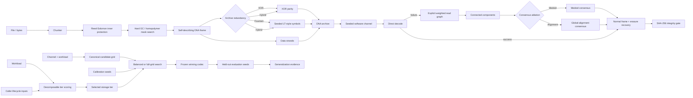

# OligoArk architecture

## Module boundaries

| Module | Responsibility |
| --- | --- |
| `dna.py` | Reversible byte/base mapping, sequence metrics, hard GC/homopolymer constraints |
| `framing.py` | Versioned headers, CRC, Reed-Solomon integration, deterministic mask search |
| `ecc.py` | Pure-Python Reed-Solomon and XOR erasure helpers |
| `fountain.py` | Independently implemented LT-style XOR symbols and peeling decode |
| `archive.py` | Archive creation, backward-compatible config parsing, recovery, SHA-256 verification |
| `simulator.py` | Seeded substitution/insertion/deletion/dropout/duplication channel |
| `reconstruct.py` | Explicit similarity graph, connected components, medoid/alignment consensus |
| `validation.py` | Direct-vs-medoid-vs-alignment rescue comparison and graph diagnostics |
| `policy.py` | Lightweight deterministic heuristic policy baseline |
| `optimizer.py` | Canonical candidate enumeration, balanced/full-grid search, objective decomposition |
| `learning.py` | Instance-based and deterministic ridge-regression policy models |
| `learning_eval.py` | Experiment-record conversion and held-out policy-learning evaluation |
| `tiering.py` | Fully decomposable tier scores and optional caller-supplied lifecycle estimates |
| `intelligence.py` | Heuristic plans, lifecycle-aware measured optimisation, held-out evaluation |
| `experiments.py` | Calibration/evaluation separation, multi-seed ablations, paired effects |
| `api.py` / `cli.py` | REST and command-line research interfaces |

## Integrity and validation invariants

1. A recovery success is accepted only after normal frame/ECC/CRC processing and archive SHA-256 verification.
2. Calibration seeds and final evaluation seeds must be disjoint for held-out optimizer evaluation.
3. Candidate search is canonical and insensitive to input ordering. Budgeted search balances redundancy/reconstruction groups; `full_grid` evaluates the complete valid grid.
4. Objective terms are returned per candidate. Physical lifecycle cost, energy, and latency terms are absent unless the caller supplies them.
5. Tier scores are decomposable: summing each returned contribution and subtracting the explicit DNA-future penalty reproduces the final score.
6. Graph rescue reports nodes, candidate pairs, retained edges, components, cluster sizes, consensus lengths, and reconstruction runtime.
7. Simulation evidence is never presented as physical synthesis/sequencing evidence.

## Archive compatibility

The archive remains `oligoark-archive-v1`. v0.1-v0.4 configuration mappings remain readable because v0.5 adds research-evaluation behavior around the archive rather than introducing a new archive format. Mask IDs 0-3 retain legacy behavior and newer IDs use deterministic whitening streams.

## Optimisation flow

`optimize_codec()` first canonicalizes the candidate space. With `search_method="balanced"`, it samples reproducibly across redundancy/reconstruction groups using the search seed; with `full_grid`, it evaluates every valid candidate. Candidate success is measured only on calibration seeds and includes verified recovery rate, encoded overhead, explicit redundancy ratio, runtime, retrieval pressure, durability reward, and optional lifecycle penalties.

`evaluate_optimized_archive_plan()` freezes the calibration winner and evaluates it on a disjoint seed set. This is the preferred API when reporting optimizer generalization.

## Reconstruction validation

`compare_reconstruction_modes()` applies three recovery paths to identical reads: direct decode, graph clustering with medoid consensus, and graph clustering with alignment-aware consensus. The controlled rescue benchmark is designed to expose whether reconstruction actually changes a direct failure into a SHA-256-verified success.

## Experiment architecture

The publication profile uses payload-size shards. Each shard preserves raw held-out trials. Aggregation recomputes Wilson intervals and paired strategy effects from all shards, then runs policy-learning evaluation and graph-rescue validation. No failed trial is removed during aggregation.
