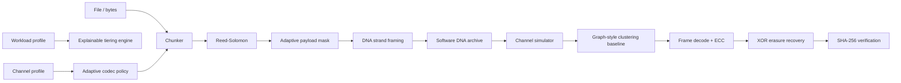

# Architecture

## Design principles

1. **Reproducible baseline first.** Core functionality is deterministic and does not require a trained model.
2. **Research modules are separable.** Tiering, adaptive codec policy, fountain-style redundancy, and graph reconstruction can be evaluated independently.
3. **Simulation is labeled as simulation.** No software benchmark is presented as synthesis or sequencing evidence.
4. **Rust-ready boundaries.** `dna.py`, `framing.py`, and `reconstruct.py` are narrow future native-acceleration candidates.

## Archive format v1

An archive is JSON containing metadata and DNA strings. Each strand carries a protected binary frame with magic/version fields, parity flag, index, data-strand count, payload length and CRC32. Reed-Solomon protects the frame, reversible masks are selected by a simple GC/homopolymer penalty, and separate XOR parity strands provide one-erasure recovery per group.
